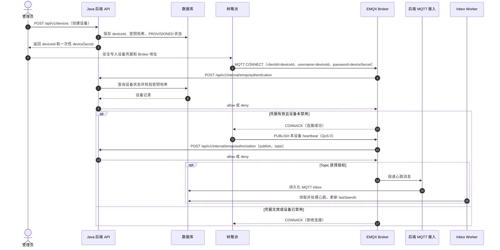

# 树莓派双目视觉与 MQTT 传输规范（v1）

本文供树莓派设备端与 BlindWay 后端联调。**线上消息的权威定义**是
[`contracts/asyncapi.yaml`](../contracts/asyncapi.yaml)、
[`contracts/schemas/mqtt/`](../contracts/schemas/mqtt/) 和
[`contracts/examples/mqtt/`](../contracts/examples/mqtt/)；本文解释 YOLOv5-Lite、双目测距结果如何转换成该契约，
不增加 v1 字段或 Topic。若本文与机器可校验契约冲突，以契约为准，并同步修订本文。

## 1. 边界与处理链

```text
同步左右帧 → 双目标定参数校验与极线校正 → 视差/深度及有效性掩码
         ↘ 校正后左目 YOLOv5-Lite 推理 → NMS → 左目坐标检测框 ↗
检测框/盲道区域 + 有效深度 → 盲道相对位置、走廊内障碍和距离质量
                          ├→ 设备本地语音/震动提醒（不等待网络）
                          └→ 契约映射 → 本地持久化队列 → MQTT → EMQX → 后端
```

本规范所说 YOLOv5-Lite 指 [ppogg/YOLOv5-Lite](https://github.com/ppogg/YOLOv5-Lite)。
其官方 `detect.py` 对推理结果执行 NMS、将检测框缩放回原图，然后遍历
`xyxy, conf, cls`；可选的本地标签文件写入归一化的 `cls, x_center, y_center, width, height`，
并可附加 `conf`。这是**检测结果/文件格式**，不是 MQTT 消息格式；模型本身不输出米制距离、
盲道走廊或安全告警。[源码](https://github.com/ppogg/YOLOv5-Lite/blob/master/detect.py)

下表是设备端中间结果约定，**不直接上传**：

| 中间结果 | 表示 | 转换要求 |
| --- | --- | --- |
| YOLO 检测框 | `x1,y1,x2,y2`，校正后左目整幅图的像素坐标 | 完成 letterbox 逆变换后才参与测距；映射为 MQTT 左上角 `x,y,width,height` |
| YOLO 类别 | 模型自己的整数 `cls` 与类别名 | 使用随模型版本固定的映射表转换为协议 `category`；不得假定 COCO 索引恒定 |
| YOLO 置信度 | NMS 后 `conf`，范围 0–1 | 映射为障碍 `confidence`；不等于视差或距离可信度 |
| 视差 | 已校正左右帧的像素对应差 `d` | 使用对应分辨率的标定参数及 `Q` 重投影；剔除无效/不一致的像素 |
| 深度 | 校正后左相机坐标系中的 `Z`，单位米 | 只从目标可见区域的有效深度聚合；严禁用框宽直接冒充实测距离 |

OpenCV 的 `stereoRectify` 生成重投影矩阵 `Q`，`reprojectImageTo3D` 将视差重投影到
**校正后第一相机**坐标系；若使用 OpenCV `StereoBM/StereoSGBM` 的 16 位视差输出，
重投影前须按文档除以 16。只有在同主点、水平双目等简化前提下，才可用 `Z≈f·B/d`
作检查；实际实现以匹配当前标定与图像尺寸的 `Q` 为准。
[OpenCV 标定与重投影文档](https://docs.opencv.org/4.x/d9/d0c/group__calib3d.html)

**设备端约定的距离语义**：`distanceMeters` / `nearestDistanceMeters` 是校正后左相机沿光轴的
正向深度 `Z`，单位米，不是斜向欧氏距离。目标区域优先使用分割掩码；若只有检测框，
从框的内缩区域提取有效深度并使用稳健的近侧分位数估计，避免背景和单个误匹配像素。
内缩比例、分位数及有效像素门槛由设备配置和实测标定确定；这些算法参数不在 v1 消息中传输。
双目时间不同步、标定不匹配、有效深度不足或超出可靠量程时，结果为不可用，不能填造一个距离。
标定时的物理尺寸须使用米，且重投影所用 `Q` 必须对应实际图像尺寸；否则输出不具有米制含义。

## 2. 连接和发送

| 项目 | v1 约定 |
| --- | --- |
| 传输 | MQTT，UTF-8 JSON；生产使用 MQTT over TLS，端口 8883（域名由部署环境提供） |
| 凭据 | 后端预配置的 `deviceId` 同时作为 MQTT `clientId`、`username`；`deviceSecret` 为密码 |
| 授权 | 仅向本设备 `blindway/v1/devices/{deviceId}/...` 的三个指定 Topic 发布 |
| Topic | `heartbeat`、`path-events`、`obstacle-events`；无设备端订阅或后端应用级 ACK Topic |
| 最大载荷 | 单条 MQTT payload 不超过 32,768 字节（UTF-8 编码后计算） |
| 心跳 | QoS 0，约每 10 秒一次；断网期间不积压，恢复后发最新状态 |
| 盲道事件 | QoS 1，状态变化时发送；稳定状态最多每 2 秒一次 |
| 障碍事件 | QoS 1，本地提醒触发时最多每秒一次；仅传走廊内且在告警阈值内的目标 |

生产 Broker 地址、TLS 信任链和设备密钥需在设备本地安全配置，不写入镜像、日志或消息体。
树莓派只向 EMQX 发起 MQTT 连接，在 MQTT CONNECT 中提供 `clientId`、`username` 和密码；
**EMQX** 再调用后端 `/api/v1/internal/emqx/authentication` 校验连接凭据，并在设备发布消息时调用
`/api/v1/internal/emqx/authorization` 校验 Topic 权限。认证/授权接口仍然需要，只是调用方是 EMQX，
不是树莓派。部署时必须在 EMQX 中配置这两个 HTTP 接口；仅启动当前 Compose 中的 EMQX 容器不会自动
完成该配置。
MQTT QoS 1 的 PUBACK 只说明 Broker 收到发布，**不保证后端已处理业务事件**；v1 没有设备可读取的
端到端业务回执。设备端应在断网和进程重启期间持久化待发 QoS 1 事件，并允许重复投递。

### 首次连接时序

前提：后端和 MQTT 接入服务已启动，且 EMQX 已配置调用后端的 HTTP 认证与授权接口。
设备凭据由管理员预先创建，再通过安全的线下配置流程写入树莓派；首次 MQTT 连接不会自动创建设备。



设备即使处于 `PROVISIONED` 状态，只要密钥正确且未禁用，也可通过当前连接认证。
用户将设备绑定到自己的账号是独立的 REST 流程，不属于 MQTT 首次连接。心跳进入 Inbox 后由 Worker
异步处理，因此 MQTT 连接成功不等于设备的 `lastSeenAt` 已经更新。

## 3. 公共信封

三个 Topic 的 payload 均为同一个 JSON 对象：

| 字段 | 类型/约束 | 生成语义 |
| --- | --- | --- |
| `schemaVersion` | 字符串，固定 `"1.0"`，必填 | 与 v1 Topic 匹配 |
| `eventId` | UUID 字符串，必填 | 每条逻辑事件新建一次；重试/补传保持原值，后端据此幂等 |
| `deviceId` | UUID 字符串，必填 | 与 Topic 中的设备 UUID 一致 |
| `tripId` | UUID 字符串或 `null`，可省略 | 已通过可信流程取得行程 ID 时填写；未知时用 `null`，后端按设备和发生时间尝试关联 |
| `bootId` | UUID 字符串，必填 | 设备端进程每次启动生成新值，同一轮运行保持不变 |
| `sequenceNo` | ≥1 的整数，必填 | 每个 `bootId` 下跨三类事件递增；重发保留原值 |
| `occurredAt` | RFC 3339 日期时间，必填 | 产生该视觉/健康事实的时间；视觉事件取参与判定的同步帧采集时间，使用 UTC |
| `sentAt` | RFC 3339 日期时间，必填 | 首次构造待发送消息的时间，须不早于 `occurredAt`；重发保留原值 |
| `payload` | JSON 对象，必填 | 随 Topic 改变；不允许额外顶层字段 |

设备必须校时；`clockSynchronized=false` 可通过心跳报告。视觉事件时间不可靠时，仍必须在本地完成安全
提醒，但应暂停上传需要按时间关联行程的事件，待校时恢复后再处理可可靠定时的事件。离线补传保留原始
`eventId`、`bootId`、`sequenceNo`、`occurredAt` 和载荷；不要把旧观察伪装成当前观察。
`sentAt` 在本约定中保持初次构造值，便于整条消息的重试内容不变。

## 4. 心跳 `.../{deviceId}/heartbeat`

心跳上报设备资源和组件状态，**不包含检测框或深度图**。完整字段以
[`heartbeat.schema.json`](../contracts/schemas/mqtt/heartbeat.schema.json) 为准；
可发送的完整样例见 [`heartbeat.valid.json`](../contracts/examples/mqtt/heartbeat.valid.json)。

| `payload` 字段 | 类型/约束 | 含义 |
| --- | --- | --- |
| `softwareVersion`, `modelVersion` | 字符串，最长分别 64/128，必填；后端要求非空 | 设备程序和部署模型版本；模型版本需能对应本地类别映射 |
| `uptimeSeconds` | ≥0 整数，必填 | 设备端运行时长 |
| `cpuUsagePercent`, `memoryUsagePercent`, `diskUsagePercent` | 0–100 数字，必填 | 设备资源使用率 |
| `cameraStatus`, `stereoStatus`, `inferenceStatus` | `UP` / `DEGRADED` / `DOWN`，必填 | 摄像头、双目测距和推理组件健康状态 |
| `clockSynchronized` | 布尔值，必填 | UTC 时钟是否可信 |
| `configVersion` | 最长 64 的字符串或 `null`，可选 | 本地配置版本，可用于追溯标定文件版本，但 v1 无专用标定 ID 字段 |
| `cpuTemperatureC` | -40 至 125 的数字或 `null`，可选 | CPU 温度，摄氏度 |
| `inferenceFps` | ≥0 数字或 `null`，可选 | 推理帧率 |
| `averageInferenceLatencyMs` | ≥0 整数或 `null`，可选 | 平均推理耗时，毫秒 |
| `networkType` | `WIFI` / `CELLULAR` / `ETHERNET` / `UNKNOWN`，可选 | 网络类型 |
| `signalDbm` | -150 至 0 的整数或 `null`，可选 | 信号强度，dBm |
| `pendingEventCount`, `droppedEventCount` | ≥0 整数，可选 | 设备本地待发和主动丢弃事件数 |

**Mock 传输示例**：Topic `blindway/v1/devices/cb94d02f-3843-41a4-8312-b549690ba21d/heartbeat`，
QoS 0。下方代码块是 MQTT payload（UTF-8 JSON），设备 UUID、行程 UUID 和时间均为演示值。

```json
{
  "schemaVersion": "1.0",
  "eventId": "f175ac94-04d1-4f18-a2d1-a1fb053547d2",
  "deviceId": "cb94d02f-3843-41a4-8312-b549690ba21d",
  "tripId": null,
  "bootId": "4fc08d04-e62e-4eed-aa46-410bebd3d498",
  "sequenceNo": 1024,
  "occurredAt": "2026-08-04T08:30:00.120Z",
  "sentAt": "2026-08-04T08:30:00.180Z",
  "payload": {
    "softwareVersion": "pi-1.0.0",
    "modelVersion": "blindway-yololite-1.0.0",
    "configVersion": "config-1.0",
    "uptimeSeconds": 3600,
    "cpuTemperatureC": 55.2,
    "cpuUsagePercent": 42.1,
    "memoryUsagePercent": 61.0,
    "diskUsagePercent": 48.0,
    "inferenceFps": 12.5,
    "averageInferenceLatencyMs": 78,
    "networkType": "WIFI",
    "signalDbm": -61,
    "cameraStatus": "UP",
    "stereoStatus": "UP",
    "inferenceStatus": "UP",
    "clockSynchronized": true,
    "pendingEventCount": 3,
    "droppedEventCount": 0
  }
}
```

## 5. 盲道观察 `.../{deviceId}/path-events`

完整字段以 [`path-event.schema.json`](../contracts/schemas/mqtt/path-event.schema.json) 为准；
可发送样例见 [`path-event.valid.json`](../contracts/examples/mqtt/path-event.valid.json)。
盲道 `state` 表示**相对设备视野**的位置，不是导航方向。仅有普通目标检测框时，
若没有训练出盲道类别或额外的盲道区域算法，不得凭障碍框推断盲道状态。

| `payload` 字段 | 类型/约束 | 映射规则 |
| --- | --- | --- |
| `state` | `LEFT` / `CENTER` / `RIGHT` / `NOT_DETECTED`，必填 | 由盲道区域相对视野中心判断；不可识别用 `NOT_DETECTED` |
| `confidence` | 0–1，必填 | 盲道识别结果的置信度；不可识别时建议 0 |
| `nearestDistanceMeters` | >0 数字或 `null`，可选 | 前方可可靠测得的最近盲道区域光轴深度；不可测时 `null` |
| `lateralOffsetMeters` | 数字或 `null`，可选 | 盲道中心相对左目光轴的横向偏移；正值向右、负值向左，不可测时 `null` |
| `measurementQuality` | `HIGH` / `MEDIUM` / `LOW` / `UNAVAILABLE`，必填 | 仅评价双目测量质量，不等于识别置信度 |
| `processingLatencyMs` | ≥0 整数，必填 | 从同步帧采集到本地结果形成的耗时 |

若盲道未检出，应发 `NOT_DETECTED`；没有可信测距时距离及偏移为 `null`，质量为 `UNAVAILABLE`。
有盲道识别结果但双目失效时仍可上报 `state`，同时使用 `UNAVAILABLE` 与空距离/偏移。

**Mock 传输示例**：Topic `blindway/v1/devices/cb94d02f-3843-41a4-8312-b549690ba21d/path-events`，
QoS 1。示例表示盲道在设备视野左侧，双目测得前方盲道深度 1.7 米、横向偏移 -0.45 米。

```json
{
  "schemaVersion": "1.0",
  "eventId": "3013e737-d294-485f-b0d4-1d427da48644",
  "deviceId": "cb94d02f-3843-41a4-8312-b549690ba21d",
  "tripId": "efb98a51-f232-4de4-bf5f-704a843cc9c6",
  "bootId": "4fc08d04-e62e-4eed-aa46-410bebd3d498",
  "sequenceNo": 1025,
  "occurredAt": "2026-08-04T08:30:02.120Z",
  "sentAt": "2026-08-04T08:30:02.180Z",
  "payload": {
    "state": "LEFT",
    "confidence": 0.91,
    "nearestDistanceMeters": 1.7,
    "lateralOffsetMeters": -0.45,
    "measurementQuality": "MEDIUM",
    "processingLatencyMs": 83
  }
}
```

## 6. 障碍快照 `.../{deviceId}/obstacle-events`

完整字段以 [`obstacle-event.schema.json`](../contracts/schemas/mqtt/obstacle-event.schema.json) 为准；
可发送样例见 [`obstacle-event.valid.json`](../contracts/examples/mqtt/obstacle-event.valid.json)。
只有位于本地盲道走廊内、深度可信且距离不超过阈值的目标进入该消息；绝不上传所有原始 YOLO 检测。

| `payload` 字段 | 类型/约束 | 映射规则 |
| --- | --- | --- |
| `tactileCorridorConfidence` | 0–1，必填 | 当前盲道走廊识别的置信度 |
| `warningThresholdMeters` | >0 且 ≤10，必填 | 本地触发提醒使用的距离阈值，单位米 |
| `minimumDistanceMeters` | >0 且 ≤10，必填 | `obstacles[*].distanceMeters` 的最小值 |
| `processingLatencyMs` | ≥0 整数，必填 | 同步帧到本地告警判定结果的耗时 |
| `obstacles` | 1–20 项，必填 | 同一快照中符合条件的目标；无目标时**不发送**障碍事件 |

每个 `obstacles[]` 项：

| 字段 | 类型/约束 | 映射规则 |
| --- | --- | --- |
| `category` | `PERSON` / `VEHICLE` / `TWO_WHEELER` / `STATIC_OBJECT` / `UNKNOWN` | 从随模型版本固定的 `cls` 映射；无法识别但确认为目标时用 `UNKNOWN` |
| `confidence` | 0–1 | YOLOv5-Lite NMS 后该检测的 `conf` |
| `distanceMeters` | >0 且 ≤10 | 该目标区域的可信近侧光轴深度，且 ≤ `warningThresholdMeters` |
| `distanceQuality` | `HIGH` / `MEDIUM` / `LOW` / `UNAVAILABLE` | 有数值距离时只能选 `HIGH` / `MEDIUM` / `LOW`；不可用时不把目标加入 v1 障碍事件 |
| `relativePosition` | `LEFT` / `CENTER` / `RIGHT` | 目标相对**校正后左目**视野的位置，不是绕行指令 |
| `boundingBox` | `x,y,width,height`；`x,y` 在 0–1，`width,height` 在 (0,1] | 基于校正后左目整幅图像的归一化左上角坐标及宽高 |

坐标转换：从原图像素框 `(x1,y1,x2,y2)` 和校正后左目尺寸 `W×H` 得到
`x=x1/W`、`y=y1/H`、`width=(x2-x1)/W`、`height=(y2-y1)/H`；框须先裁剪到图像边界，
且 `x+width≤1`、`y+height≤1`。例如 `W=640,H=480`，像素框
`(160,96,320,336)` 对应 `{ "x":0.25, "y":0.2, "width":0.25, "height":0.5 }`。
**不能**把 YOLO 标签文件的中心点 `x_center,y_center` 直接填进协议的 `x,y`。

若双目测距不可用，v1 障碍消息没有可表达“有目标但距离未知”的有效数值组合：
`distanceMeters` 和 `minimumDistanceMeters` 均必填且为正数。设备应在本地按保守策略提醒并通过心跳报告
`stereoStatus=DEGRADED/DOWN`，不得虚构一个距离或发送不符合 Schema 的障碍事件。
`distanceQuality` 的 HIGH/MEDIUM/LOW 门槛应由有效视差比例、左右一致性、深度离散度和标定实测误差
共同决定；具体数值需在目标摄像头与量程验收后写入设备配置，不能仅凭 YOLO 置信度决定。

**Mock 传输示例**：Topic `blindway/v1/devices/cb94d02f-3843-41a4-8312-b549690ba21d/obstacle-events`，
QoS 1。示例表示盲道走廊内检测到一名行人，双目深度 1.8 米，低于本地 3.0 米告警阈值。
`boundingBox` 为校正后左目整幅图的归一化左上角坐标和宽高。

```json
{
  "schemaVersion": "1.0",
  "eventId": "77e137bc-ad4f-4e55-871e-c223cc3a6eb1",
  "deviceId": "cb94d02f-3843-41a4-8312-b549690ba21d",
  "tripId": "efb98a51-f232-4de4-bf5f-704a843cc9c6",
  "bootId": "4fc08d04-e62e-4eed-aa46-410bebd3d498",
  "sequenceNo": 1026,
  "occurredAt": "2026-08-04T08:30:03.120Z",
  "sentAt": "2026-08-04T08:30:03.180Z",
  "payload": {
    "tactileCorridorConfidence": 0.88,
    "warningThresholdMeters": 3.0,
    "minimumDistanceMeters": 1.8,
    "processingLatencyMs": 96,
    "obstacles": [
      {
        "category": "PERSON",
        "confidence": 0.94,
        "distanceMeters": 1.8,
        "distanceQuality": "MEDIUM",
        "relativePosition": "CENTER",
        "boundingBox": { "x": 0.38, "y": 0.24, "width": 0.21, "height": 0.63 }
      }
    ]
  }
}
```

## 7. 校验、幂等与验收

1. 设备端先校验标定文件对应的摄像头、分辨率与相机顺序；左右帧不同步或标定失败时禁止输出“可信距离”。
2. 组装消息前按相应 JSON Schema 校验：`schemaVersion=1.0`、Topic/载荷 `deviceId` 一致、
   `sentAt≥occurredAt`、字段枚举/范围正确，UTF-8 长度不超过 32,768 字节。
3. 心跳 QoS 0 不补传；盲道/障碍 QoS 1 在本地落盘后发送，重试保持同一逻辑事件及 `eventId`。
4. 同一目标帧的多个走廊内障碍合并为一个快照；`minimumDistanceMeters` 等于数组中最小的距离。
   后端还会拒绝任何超过 `warningThresholdMeters` 的障碍距离。
5. 联调时验证：正确凭据可连接、错误凭据和越权 Topic 被拒；有效三类样例可被处理；
   重发同一 `eventId` 不重复产生业务数据；断网不影响本地提醒；双目失效不产生伪造距离。

注意：当前后端的业务校验、设备端的模型输出映射及质量门槛是不同层次。JSON Schema 和示例是外部
契约；后端还校验障碍距离不超过告警阈值。本文额外规定的“距离不可用时不发送障碍事件”、
“帧时间语义”和“质量评估方法”是**设备端实现约定**，仓库目前没有真实树莓派程序或端到端硬件验收，
不能将它们误写成已经在设备上实现的功能。
