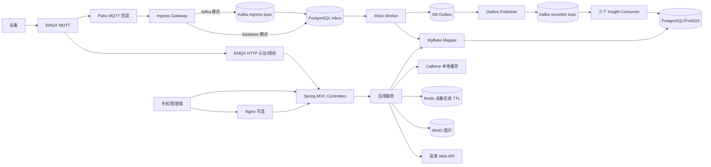
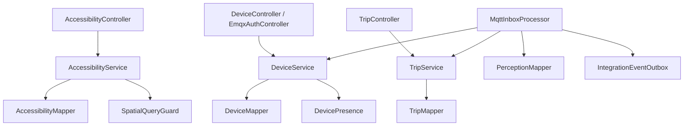
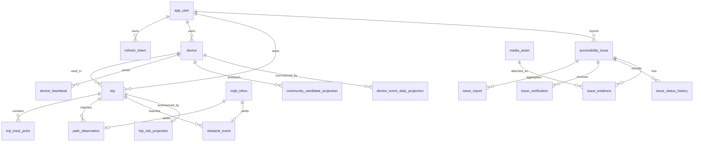
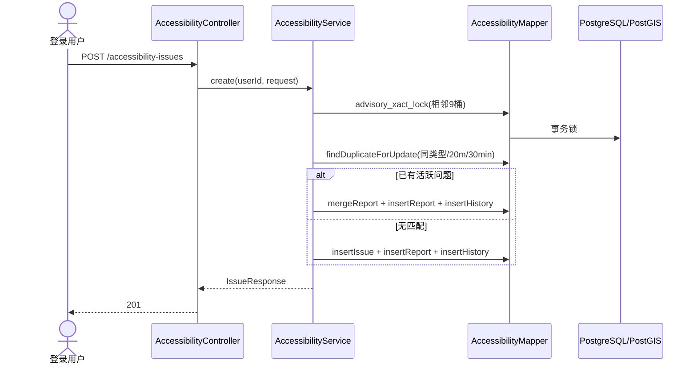
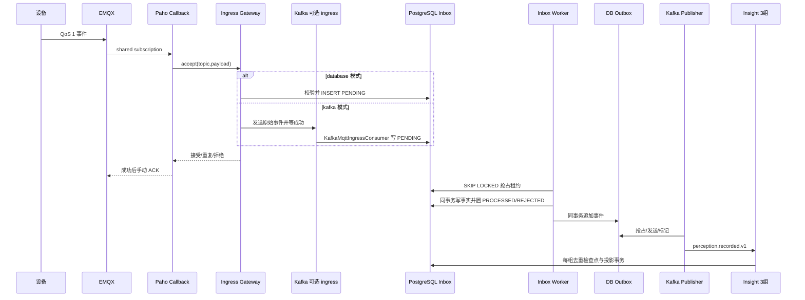

# BlindWay 后端项目技术文档

> 代码审阅基线：2026-09-14，工作树当前提交 `2e00af5`（2026-09-12）。状态标记：**Implemented**＝当前代码有可追踪实现；**Partially Implemented**＝仅部分链路、配置或验证成立；**Proposed**＝建议或尚未验证。本文以 `src/main/java`、`src/main/resources`、`src/test/java`、`contracts/` 和部署配置为事实来源。历史压测数字只代表原报告所述环境，不代表当前提交的生产容量。

## 1. 项目概述

**背景与目标。** 仓库实现面向视障人士出行场景的后端：手机上传 WGS84 行程轨迹，设备上报心跳、盲道观察和障碍事件；后端管理账号、设备、行程、感知事实与长期无障碍问题，并对附近问题和候选路线提供风险查询。此目标由实际 API、MQTT 入口和数据表支持，见 `identity/api/AuthController.java`、`trip/api/TripController.java`、`perception/application/MqttInboxProcessor.java`、`accessibility/api/AccessibilityController.java`。设备端实时识别与提醒、手机端持续导航不在本 Java 应用中；仓库只有 `tools/pi-simulator` 和 `tools/phone-simulator.http` 模拟/联调工具。真实产品使用人数、运营地域、商业目标：**无法从当前项目确认**。

| 用户/系统 | 代码可确认的场景 | 解决的问题 |
|---|---|---|
| 普通用户 `USER` | 注册登录、绑定设备、开始行程、上传轨迹、上报/核验问题、查看附近问题和路线风险 | 将出行轨迹与设备感知关联，并积累可查询的长期问题 |
| 志愿者 `VOLUNTEER`、管理员 `ADMIN` | 问题状态治理；管理员另可配置设备、重放失败 Inbox 消息 | 让社区问题有受控流转和恢复入口 |
| EMQX/设备 | 设备凭据与 Topic 授权；MQTT 三类消息接入 | 将设备事件可靠记录和异步处理 |
| 运维人员 | Actuator/Prometheus、Compose、备份脚本 | 观察、部署与恢复；是否已投入生产**无法从当前项目确认** |

**边界。** `insight` 的社区候选仅记录符合条件的固定障碍投影；它没有自动创建 `accessibility_issue`。高德接口提供逆地理编码和步行路线预览，路线风险接口接收客户端提供的坐标点；代码没有自动取得多条路线并重排。见 `insight/application/CommunityCandidateProjectionConsumer.java`、`map/api/MapController.java`、`accessibility/application/AccessibilityService.java`。

## 2. 需求分析

### 2.1 已实现的功能需求与 Use Case

下表的输入/输出均指当前入口的实际行为，错误仅列主要分支。HTTP 详细字段和权限见第 7 节。

| 模块 / 目标与主要用户 | 输入 → 核心处理 → 输出 | 主要异常与边界 | 证据 |
|---|---|---|---|
| 身份认证；普通用户 | 邮箱、密码、显示名注册；邮箱归一化、BCrypt 哈希、建用户及刷新令牌，返回 JWT/刷新令牌。登录校验 ACTIVE 状态；刷新时插入新令牌并条件撤销旧令牌；注销撤销旧令牌 | 邮箱冲突 409；凭据或刷新令牌无效 401；并发刷新仅一个条件撤销成功 | `identity/api/AuthController.java`、`identity/application/AuthService.java`、`identity/infrastructure/IdentityMapper.java` |
| 设备；管理员/设备所有者/EMQX | 管理员配置设备并一次返回随机密钥；用户凭密钥绑定；所有者查询与轮换密钥；EMQX 调用认证及 Topic 授权。心跳更新在线状态 | 错误密钥 401、不可绑定 409、无所有权 404；Redis 不可用时在线判断退化为数据库时间窗口 | `device/api/*Controller.java`、`device/application/DeviceService.java`、`device/infrastructure/DevicePresence.java` |
| 行程；已绑定用户 | 传设备 ID 开始行程；批量上传 1–100 个轨迹点；完成行程。事件按时间窗匹配前后轨迹点并插值，输出位置与质量分级 | 非所有者 403、设备已有活动行程 409、非法轨迹时间 400、活动行程不存在 404；重复时间点 `ON CONFLICT DO NOTHING` | `trip/api/TripController.java`、`trip/application/TripService.java`、`trip/infrastructure/TripMapper.java` |
| 感知接入；设备/EMQX | MQTT Topic 和 JSON envelope → 校验大小、Topic、版本、设备 ID → 持久化 Inbox；Worker 解码三种载荷、查设备、匹配行程、写事实表与 Outbox | 非法载荷拒绝；数据库/Kafka 故障不确认 QoS 1 消息；失败重试/终态 DEAD，管理员可重放 | `perception/infrastructure/MqttIngressCallback.java`、`perception/application/MqttIngressService.java`、`MqttInboxWorker.java`、`MqttInboxProcessor.java` |
| 社区问题；普通用户/治理人员 | 上报类型、描述、严重度及坐标；20 米/30 分钟内同类型活跃问题聚合并保留每条 Report；用户投票更新可信度；志愿者/管理员按状态机和版本治理；查询附近、详情、报告与路线风险 | 无效转换/版本冲突 409；空间查询繁忙 429、超时 503；缺失问题 404 | `accessibility/api/AccessibilityController.java`、`accessibility/application/AccessibilityService.java`、`accessibility/infrastructure/AccessibilityMapper.java` |
| 图片证据；登录用户 | 上传 5 MB 内 JPEG/PNG/WebP，检查文件头，MinIO 存对象、数据库记元数据，返回 10 分钟签名 URL；将本人媒体关联到问题 | 存储默认关闭时 503；内容类型或签名错误 400；非本人媒体 404；DB 与 MinIO 不具原子性 | `media/api/MediaController.java`、`media/application/MediaService.java`、`accessibility/application/AccessibilityService.java` |
| 地图；登录用户 | WGS84 坐标 → 高德转换为 GCJ-02 → 逆地理编码或步行路线预览 | 未配置 Web Key 或远端失败 503；两次 HTTP 尝试仅针对网络异常/5xx | `map/api/MapController.java`、`map/infrastructure/AmapMapProvider.java` |
| 事件投影；内部 Kafka 消费者 | 业务 Outbox → Kafka `perception.recorded` → 三独立消费组，生成社区候选、行程风险计数、设备日统计 | 消费组独立去重；失败重试与 DLT；当前无这些投影的对外查询 API | `common/application/KafkaOutboxPublisher.java`、`insight/application/*Consumer.java` |

**完整 Use Case 示例。** 上报问题：`AccessibilityController.create` → `AccessibilityService.create` 获取 3×3 相邻空间桶事务 advisory lock → `AccessibilityMapper.findDuplicateForUpdate` → 新增问题或 `mergeReport` → 写 `issue_report` 和 `issue_status_history` → 清理短缓存 → 返回 `IssueResponse`。行程感知：MQTT 回调 → `MqttIngressGateway`（数据库或 Kafka 模式）→ `MqttIngressService.accept` → `mqtt_inbox` → `MqttInboxWorker` → `MqttInboxProcessor` → `TripLocationAccess.resolve` → 感知事实与 Outbox；Kafka 可选启用时再投影。各步骤在第 6 节展开。

### 2.2 非功能需求：现状与目标

| 维度 | 当前能力/状态 | 尚未验证或建议目标 |
|---|---|---|
| 性能与并发 | **Implemented**：Hikari 最大 10 连接；空间查询公平信号量默认 5、50 ms 等待、SQL 超时 1/1.5 秒；Caffeine 短缓存；MQTT Kafka 模式最多 1000 个 in-flight。见 `application.yml`、`SpatialQueryGuard.java`、`KafkaMqttIngressGateway.java` | **Proposed**：独立压测机、冷缓存、长稳态和真实路线验证。不能把配置并发数当吞吐或在线人数 |
| 可用性/容错 | **Partially Implemented**：优雅停机、健康探针、Nginx 代理、Outbox/Inbox 租约、Kafka 三副本配置与 DLT；Compose 中 PostgreSQL、EMQX 为单实例 | **Proposed**：跨主机故障、滚动发布、恢复时间和备份恢复演练；生产高可用**无法从当前项目确认** |
| 可靠性与一致性 | **Implemented**：数据库事务、唯一键、条件更新、幂等消费；MQTT ACK 在网关接受后。**Partially Implemented**：MinIO 与数据库双写；各实例本地缓存不一致 | **Proposed**：对象存储补偿、跨实例缓存失效、完整端到端丢失率验证 |
| 安全性 | **Implemented**：JWT、BCrypt、刷新令牌哈希与轮换、角色/所有权检查、Bean Validation。**Partially Implemented**：内部 EMQX 接口仅靠部署网络隔离，仓库网关配置未限制路径；媒体隐私处理标志固定 false | **Proposed**：TLS/网络 ACL 真实验收、限流、隐私处理与审计验证 |
| 扩展性/维护性 | **Implemented**：模块化包、Spring Modulith/ArchUnit 边界测试、MyBatis Mapper、Flyway、契约样例及 CI；Kafka 消费组可独立进度 | **Partially Implemented**：一些 schema 表和投影尚无读写闭环；覆盖率目标未由当前本地测试证实 |

## 3. 系统架构

**Implemented**：单个 `BlindWayApplication` 部署单元。Web 为 Spring MVC `@RestController`；应用层 `@Service` 管理事务；领域层主要是状态枚举、消息 DTO 和跨模块接口；持久化使用注解式 MyBatis Mapper、PostgreSQL 18/PostGIS（Compose 镜像版本），Flyway V1–V7 管理模式。没有 JPA Entity 或 Spring Data Repository；`spring-boot-starter-data-redis` 提供 `StringRedisTemplate`。Spring Security 是无状态 JWT 资源服务器。Spring Cache + Caffeine 用于空间查询，Spring Scheduling 用于 Inbox、Outbox 和保留清理。没有发现 `ApplicationEventPublisher` 或 `@EventListener` 业务事件链路。见 `pom.xml`、`BlindWayApplication.java`、`common/security/SecurityConfig.java`、`common/infrastructure/CacheConfig.java`。





`insight` 通过事件依赖 `perception` DTO；`perception` 仅通过 `DeviceAccess` 与 `TripLocationAccess` 接口调用设备、行程模块。`common` 提供安全、异常、缓存及 Outbox 技术能力。`ArchitectureTest.java` 调用 Spring Modulith `ApplicationModules.verify()` 并检查 API 层不直接依赖 infrastructure。

## 4. 核心模块设计

| 模块 | Controller / 应用服务 / Mapper 或适配器 | 核心 DTO、模型与依赖 | 关键设计决策 |
|---|---|---|---|
| `identity` | `AuthController` → `AuthService` → `IdentityMapper` | `RegisterRequest`、`LoginRequest`、`TokenResponse`、`UserRow`、`RefreshTokenRow`、`UserRole`；依赖 `common.security` | 用户密码 BCrypt；刷新令牌仅存 SHA-256；JWT HS256 带 role claim |
| `device` | `DeviceController`、`EmqxAuthController` → `DeviceService` → `DeviceMapper`、`DevicePresence` | `DeviceRow`、`DeviceStatus`、`DeviceAccess`；依赖 Redis | 设备密钥随机生成、哈希保存；绑定用条件 UPDATE；在线值 Redis 30 秒 TTL 与 DB `last_seen_at` 兜底 |
| `trip` | `TripController` → `TripService` → `TripMapper` | `TripRow`、`TrackPointInput`、`TripLocationAccess.LocationMatch`；依赖设备表所有权查询 | 活动行程部分唯一索引；轨迹批量 INSERT；±10 秒点匹配、插值质量分类 |
| `perception` | 无公开业务 REST；`MqttInboxAdminController` 提供重放；Paho 回调 → Gateway/Ingress/Worker/Processor → `PerceptionMapper` | `MqttEnvelope`、三种 Payload、`RawMqttIngressEvent`、`PerceptionRecordedEvent`；依赖 `DeviceAccess`、`TripLocationAccess`、Outbox | 接入与业务处理解耦；Inbox `event_id` 幂等；租约/重试；动态事件不直接成为社区 Issue |
| `accessibility` | `AccessibilityController` → `AccessibilityService`、`SpatialQueryGuard` → `AccessibilityMapper` | `IssueStatus`、`IssueType`、各请求/响应 record、`IssueRow` | 空间时间去重、每次报告留痕、社区投票信任度、状态机+乐观锁、PostGIS 风险排序 |
| `insight` | 无 Controller；三个 `*ProjectionConsumer` → `InsightMapper` | `PerceptionRecordedEvent`、`kafka_consumed_event` | 独立消费组及每组事件去重；只把高/中质量定位的静态障碍记作候选 |
| `media` | `MediaController` → `MediaService` → `MediaMapper`、MinIO SDK | `MediaResponse`、`media_asset` | 私有对象、签名 URL、文件头初检；元数据与对象双写尚无补偿 |
| `map` | `MapController` → `MapProvider` / `AmapMapProvider` | `ReverseGeocode`、`WalkingRoute` | WGS84 转 GCJ-02 后调用高德；没有落库或完整导航编排 |
| `common` | `ApiExceptionHandler`、`TraceIdFilter`、`SecurityConfig`、`CacheConfig`、`KafkaOutboxPublisher` | `ApiException`、`IntegrationEventOutbox`、`EventOutboxMapper` | 技术横切能力；Outbox 发布与业务事务分离 |

所有类位于 `src/main/java/com/blindway/<模块>/`。这里的 `Row` 是 MyBatis 映射 record，并非 JPA Entity；响应主要为 record DTO，没有单独 VO 层。

## 5. 数据库设计

最终 schema 为 V1 叠加 V2–V7，不能只看初始迁移。`src/main/resources/db/migration/` 中的约束由 Flyway 在启动时应用。主要表和字段如下；除特别说明，UUID 主键均由应用生成。

| 表 / 主键 | 关键字段与关系 | 关键约束/索引 | 使用情况 |
|---|---|---|---|
| `app_user` / `id` | `email`,`password_hash`,`display_name`,`role`,`status` | email 唯一；role/status CHECK | 注册、登录、授权主体 |
| `refresh_token` / `id` | `user_id`→user、`token_hash`,`expires_at`,`revoked_at`,`replaced_by` | token_hash 唯一；`(user_id,expires_at)` 索引 | 轮换和注销；`replaced_by` 未声明 FK |
| `device` / `id` | `owner_user_id`→user、`secret_hash`,`status`,`last_seen_at`,软件/模型版本 | `(owner_user_id,created_at)` 索引 | 配置/绑定/心跳 |
| `trip` / `id` | `user_id`→user、`device_id`→device、`status`,`started_at`,`ended_at` | `device_id WHERE status='ACTIVE'` 唯一；用户时间索引 | 活动行程 |
| `trip_track_point` / bigint `id` | `trip_id`→trip、`recorded_at`,`location geography(Point,4326)`,`accuracy_meters`,`speed_meters_per_second` | `(trip_id,recorded_at)` 唯一；时间及 GiST 空间索引 | 批量轨迹、位置匹配 |
| `mqtt_inbox` / `event_id` | `device_id`,`trip_id`,`topic`,`boot_id`,`sequence_no`,`raw_payload jsonb`,`process_status`,`attempt_count`,`next_attempt_at`,`lease_*`,`error_code` | event_id 主键；claim/dead 部分索引；`device_id`/`trip_id` 未声明 FK | 原始接入、重试、审计；V5 的 `kafka_partition/offset` 当前 Mapper 不写入 |
| `device_heartbeat` / bigint `id` | 唯一 `event_id`、`device_id`→device、设备运行指标 | 设备时间索引；状态 CHECK | 心跳事实 |
| `path_observation` / bigint `id` | 唯一 `event_id`→inbox、`device_id`→device、可空 `trip_id`/轨迹点、位置与质量、状态/置信度 | 行程时间及位置 GiST 索引；质量/状态 CHECK | 盲道观察事实 |
| `obstacle_event` / bigint `id` | 与 path 相同关系；另有阈值、距离、`obstacles jsonb` | 行程时间及位置 GiST 索引；距离 CHECK | 障碍事实 |
| `accessibility_issue` / `id` | `reporter_user_id`→user、可空 `tactile_path_segment_id`、类型/描述/状态/位置、severity、计数、可信度、`version`、处理/解决/关闭时间 | 位置 GiST、去重索引、活跃风险表达式索引、CHECK | 聚合问题与风险读取 |
| `issue_report` / `id` | `issue_id`→issue、可空 reporter、source、类型/严重度/位置/时间 | issue 时间和位置索引 | 每次独立上报；应用只写 `USER`，`ADMIN_IMPORT` 见压测种子 |
| `issue_verification` / `id` | `issue_id`→issue、`user_id`→user、decision/note | `(issue_id,user_id)` 唯一 | 一人每 Issue 一个当前投票 |
| `issue_status_history` / `id` | `issue_id`→issue、`changed_by`→user、前后状态/理由 | issue 时间索引 | 治理历史；当前无读取 API |
| `media_asset` / `id`；`issue_evidence` / `id` | media owner、object_key、类型/大小/SHA-256；evidence 关联 issue/media/user | object_key 唯一；`(issue_id,media_asset_id)` 唯一 | 私有证据；`privacy_processed` 当前固定 false |
| `integration_event_outbox` / `id` | 聚合、Topic、JSON payload、发布状态、租约/重试 | 待发布部分索引 | 事务 Outbox |
| `kafka_consumed_event` / `(consumer_name,event_id)` | 每组消费检查点 | 联合主键 | 投影幂等 |
| `community_candidate_projection` / `event_id` | device/trip FK、category、位置/质量 | 位置 GiST | 固定障碍候选，未自动进 Issue |
| `trip_risk_projection` / `trip_id`；`device_event_daily_projection` / `(device_id,event_day)` | 行程风险计数；设备按 UTC 日计数 | PK/FK | 当前仅写投影，无对外读取 API |
| `tactile_path_segment` / `id`；`route_plan` / `id` | 盲道路段线、来源/审核；用户路线起终点/有效期 | 路段 GiST；相应 FK | **Partially Implemented**：有表，但未发现应用 Mapper/Service/Controller 使用 |



事务边界主要在应用服务 `@Transactional`；MQTT 业务事实、Inbox 状态与 Outbox 在 `MqttInboxProcessor.process` 同一数据库事务。投影消费者把去重检查点与投影更新放在同一事务。默认传播/隔离未显式指定，使用 Spring `REQUIRED` 和数据库默认隔离，具体部署数据库隔离参数**无法从当前项目确认**。见第 9 节。

## 6. 核心业务流程

### 6.1 用户上报与问题治理



**事务/并发。** `create` 的九桶 advisory lock 按排序获取，重复候选再 `FOR UPDATE`；同热点会串行化。`verify` 在事务中 upsert 每用户投票、统计、更新可信度/状态及历史。治理 `transition` 根据 `IssueStatus.canTransitionTo` 和 `WHERE version=? AND status=?` 乐观锁更新并记录历史；冲突 409。`issue_report` 是原始证据，聚合并不丢失新报告。`AccessibilityMapper.nearby` 包含 `PENDING`、`VERIFIED`、`PROCESSING`，按风险分数、距离、最近上报排序；OpenAPI 当前写“按距离升序”，与 SQL **不一致**。`reports` 未分页。

### 6.2 行程与定位匹配

用户开始行程时，服务检查设备所有权及 ACTIVE 状态，数据库部分唯一索引防止同设备两个活动行程。轨迹批次先校验时间，再一次 INSERT，`(trip_id,recorded_at)` 冲突忽略。完成行程为条件 UPDATE。感知处理通过 `TripLocationAccess.resolve` 限定行程和事件时间，查询前后各 10 秒且精度 ≤50 米的点，插值或取最近点，返回 `HIGH/MEDIUM/LOW/UNMATCHED` 质量；没有合格行程或轨迹仍可存无位置事件。见 `TripService.java`、`TripMapper.java`。

### 6.3 MQTT 入站、重试与事件扇出



数据库模式默认（`blindway.mqtt.ingress-mode=database`），Kafka 入口模式需 `MQTT_INGRESS_MODE=kafka` 且 Kafka 可用。`blindway.mqtt.enabled=false` 与 `blindway.kafka.enabled=false` 是直接运行应用的默认值；Compose `app` profile 把 MQTT 开启，但 Kafka 仍默认关闭。Inbox Worker 的 `@Scheduled` **没有**按 MQTT enabled 条件启停，只要应用启动就会轮询数据库。`MqttIngressService.accept` 的 `event_id` PK 防重复；处理阶段的事实表 event_id 唯一，Outbox ID 同 eventId。`MqttInboxWorker` 领取后处理失败按指数退避，最多默认 5 次后 DEAD；管理员可从 DEAD/REJECTED 重放。注意 `MqttInboxProcessor.process` 在 `try` 外先 `decode`：已进入 Inbox 但无法解码的记录会被 Worker 当成可重试故障，最终 DEAD，而非直接 REJECTED。见相应类和 V7 迁移。

Kafka Publisher 默认 100 ms 轮询、50 条/批，租约默认 30 秒，发送失败最多 10 次后 Outbox DEAD。三个消费组先写 `(consumer_name,event_id)` 再更新投影，Kafka 偏移按 record ACK；数据库暂时故障无限重试，其他“毒消息”3 次退避后进 DLT。Producer `acks=all` 且启用 idempotence；由于数据库标记与 Kafka 发送不原子，整体是**至少一次投递 + 消费端业务幂等**，不是端到端 exactly-once。相同 deviceId 作为 Kafka key 使同设备消息落同一分区，但处理顺序还受 Inbox Worker 抢占和不同阶段影响，业务全序**无法从当前项目确认**。见 `KafkaEventConfig.java`、`EventOutboxMapper.java`、三个投影消费者。

### 6.4 空间读路径

`nearby` 和 `assessRoute` 先查本机 Caffeine；未命中由 `SpatialQueryGuard` 公平信号量保护，再在只读事务内设置 `statement_timeout`，MyBatis/PostGIS 执行查询。路线路径超过 20 点时先简化/分段选候选，再以原始路线精确距离过滤，最多返回 100 个风险 Issue，风险贡献求和封顶 100。异常分别映射 429/503。地图路线预览由高德单独提供，未自动调用此风险函数。

## 7. API 设计

所有路径以下表的 `/api/v1` 为前缀。除注明公开者，`SecurityConfig` 要求 Bearer JWT；未授权常见 401，角色不足 403。成功响应直接为 DTO/数组/Map，无通用包装；业务错误由 `ApiExceptionHandler` 生成带 `code`、`traceId`、`fieldErrors` 的 `ProblemDetail`。字段级约束见各 `api/*Request.java`、`contracts/openapi.yaml`；`@Valid` 用于 JSON record，`@Validated` 用于查询参数。下表状态码是 Controller 明确状态与主要业务分支，框架还可能返回其他错误。

| 方法与路径 | 输入 → 输出 | 权限；成功/主要异常 |
|---|---|---|
| POST `/auth/register` | `email,password,displayName` → `TokenResponse` | 公开；201 / 400,409 |
| POST `/auth/login` | `email,password` → `TokenResponse` | 公开；200 / 400,401 |
| POST `/auth/refresh` | `refreshToken` → 新 `TokenResponse` | 公开；200 / 400,401 |
| POST `/auth/logout` | `refreshToken` → 空 | 公开；204 / 400 |
| GET `/devices` | 无 → 本人设备数组、online | JWT；200 |
| POST `/devices` | `label` → 设备与一次性密钥 | ADMIN；201 / 400,403 |
| POST `/devices/{deviceId}/binding` | `deviceSecret` → 空 | JWT；204 / 401,404,409 |
| POST `/devices/{deviceId}/secret-rotation` | 路径 ID → 新密钥 | 设备所有者；200 / 404 |
| POST `/trips` | `deviceId` → `TripResponse` | JWT+设备所有权；201 / 403,409 |
| POST `/trips/{tripId}/track-points` | ≤100 轨迹点 → `{inserted}` | JWT+活动行程所有权；202 / 400,404 |
| POST `/trips/{tripId}/completion` | 路径 ID → `TripResponse` | JWT+行程所有权；200 / 404 |
| GET `/accessibility-issues` | 经/纬度、半径 10–5000 m、limit 1–100 → Issue 数组 | JWT；200 / 400,429,503 |
| POST `/accessibility-issues` | type、description、severity 1–5、坐标 → `IssueResponse` | JWT；201 / 400；聚合时仍 201 |
| POST `/accessibility-issues/route-risk-assessments` | 2–500 个路线点、可选走廊 5–100 m → 分数/等级/贡献 | JWT；200 / 400,429,503 |
| GET `/accessibility-issues/{issueId}` | ID → `IssueResponse` | JWT；200 / 404 |
| GET `/accessibility-issues/{issueId}/reports` | ID → 原始报告数组 | JWT；200 / 404 |
| POST `/accessibility-issues/{issueId}/verifications` | `decision,note` → 空 | JWT；204 / 404,409 |
| POST `/accessibility-issues/{issueId}/transitions` | `targetStatus,reason,version` → 更新后的 Issue | VOLUNTEER/ADMIN；200 / 403,404,409 |
| POST `/accessibility-issues/{issueId}/evidence` | `mediaAssetId` → 空 | JWT+媒体所有权；204 / 404 |
| POST `/media` | multipart `file` → `MediaResponse` 与签名 URL | JWT；201 / 400,503 |
| GET `/media/{mediaId}/access-url` | ID → `{accessUrl}` | 媒体所有者；200 / 404,503 |
| GET `/map/reverse-geocode` | WGS84 经/纬度 → 地址 | JWT；200 / 400,503 |
| GET `/map/walking-routes` | 起终点 WGS84 → 距离、时长、GCJ-02 polyline | JWT；200 / 400,503 |
| POST `/admin/mqtt-inbox/{eventId}/replay` | eventId → 空 | ADMIN；204 / 403,409 |
| POST `/internal/emqx/authentication` | username/clientid/password → allow/deny | HTTP 公开、预期仅 EMQX 内网；200 |
| POST `/internal/emqx/authorization` | username/clientid/action/topic → allow/deny | HTTP 公开、预期仅 EMQX 内网；200 |

**契约差异。** `contracts/openapi.yaml` 的 nearby 描述为距离升序，当前 SQL 实际先按风险分数降序。OpenAPI replay 描述“幂等业务写入”，但重放完整幂等仍依赖各表约束及处理链路，不代表所有副作用绝对一次。API 路由反射测试覆盖声明一致性，并非 HTTP 行为测试。

## 8. Java 技术实现分析

`pom.xml` 目标 Java 21、Spring Boot parent 4.1.0、Maven 构建；没有 Gradle。构造器注入和 `@Configuration` Bean 实现 IoC/DI；`@Transactional`、`@Cacheable/@CacheEvict`、`@PreAuthorize` 使用 Spring 代理式 AOP。业务 DTO、Mapper 行、事件多数采用 Java record；泛型用于 `List<TrackPointInput>`、`Optional<UserRow>`、`MqttIngressService.Result` 的 `CompletionStage` 等。Stream 用于设备列表映射、路线点拼接/分数求和、消息类别去重；集合主要为 `List`、`Set`、`Map`。见 `AccessibilityService.java`、`DeviceService.java`、`KafkaMqttIngressGateway.java`。

并发机制不是自定义大线程池：空间查询用公平 `Semaphore`；Kafka 入站用 `Semaphore` 控制 in-flight、`CompletableFuture` 完成回调与超时；Paho 失败重连使用 `CompletableFuture.delayedExecutor`；定时任务池配置为 4。`@Scheduled` 用于 Inbox 轮询、Outbox 发布和凌晨 UTC 保留清理。没有发现 `synchronized` 业务锁、Java CAS 更新数据库、显式线程池 Bean 或 Spring Event 业务监听。数据库并发依赖锁、唯一约束和条件 UPDATE。

序列化使用 Spring Boot 4 的 Jackson (`tools.jackson`)，对未知 JSON 属性启用失败；感知 envelope 和 Kafka 事件为 JSON，PostgreSQL 用 `jsonb` 存 Inbox/障碍/Outbox。日志使用 SLF4J，配置 `logging.structured.format.console: logstash`；HTTP filter 写 MDC traceId，Inbox 处理写 MDC eventId/deviceId。异常统一为 RFC 9457 风格 `ProblemDetail`，详见第 13 节。

## 9. 事务与并发控制

| 操作 | 事务和并发措施 | 潜在边界 |
|---|---|---|
| 认证注册/登录/刷新/注销 | `AuthService` 全部 `@Transactional`；email/token 唯一键；刷新先插新记录，再以 `revoked_at IS NULL` 条件撤销旧记录，失败回滚 | JWT 已签发与 DB 事务提交存在极短窗口，但响应在调用完成后返回；无登录限流 |
| 设备绑定/轮换 | `DeviceService` 写方法 `@Transactional`；绑定要求未绑定且 PROVISIONED，轮换要求本人 ACTIVE | `markSeen` 不比较时间先后，迟到心跳可把 `last_seen_at` 与版本回写为旧值 |
| 行程 | `TripService` 写方法 `@Transactional`；活动行程部分唯一索引；轨迹唯一键冲突忽略；完成用状态条件 UPDATE | `appendTrackPoints` 先读 ACTIVE 后插入，和并发 completion 缺少同一行锁/最终状态复查，可能在完成后插入点；其时间只受开始时间及当前时间限制 |
| 问题聚合/治理 | `AccessibilityService` 事务；九桶 advisory xact lock、候选 `FOR UPDATE`；治理按 version/status CAS；投票 upsert 后重算 | `verify` 未锁 Issue 行，两个并发不同用户投票可能以旧计数/状态计算并覆盖；`updateStatus` 不检查期望版本，且历史使用先前读到的状态；可在治理 PROCESSING/REOPENED 时继续投票更新可信度，但 UPDATE 状态只覆盖 PENDING/VERIFIED/REJECTED，此时即使实际未更新也可能插入一条状态历史 |
| Inbox 处理 | `MqttInboxProcessor.process` 同事务写事实、Outbox 与终态；Worker 抢占使用 `FOR UPDATE SKIP LOCKED`、租约所有者条件 | 租约到期与慢事务交叠时可能重试，依赖唯一键和回滚；非法 envelope 解码位于 try 外会走重试/DEAD |
| Outbox/Kafka 投影 | DB Outbox 与业务事务同库；Publisher 租约抢占；消费者每组去重检查点与投影在同事务 | Publisher 发 Kafka 成功但更新 DB 前崩溃会重发；消费去重吸收业务重复，无法保证物理只投递一次 |
| 媒体 | DB 记录 `@Transactional`，MinIO `putObject` 在 DB 事务内但不是同一事务 | DB 失败可留下孤儿对象；签名 URL 生成失败会导致 DB 回滚但对象已存在；缺少删除/补偿 |

代码未设置自定义事务传播与隔离级别、JPA `@Version`、Redis 分布式锁。PostgreSQL advisory lock 是问题聚合跨实例锁；`version` 条件更新是应用级乐观锁。普通 REST 请求没有统一幂等键；轨迹 `(trip_id,recorded_at)`、设备绑定条件、证据唯一键、投票 upsert、MQTT `event_id` 分别提供局部重复处理。见各 Mapper SQL 和 V1–V7 迁移。

## 10. 缓存设计

**Implemented**：`CacheConfig` 注册两个**进程内 Caffeine** 缓存：`nearbyIssues` 最多 2000 条、写后 3 秒；`routeRisks` 最多 1000 条、写后 5 秒。`@Cacheable(sync=true)` 让同 JVM 同 key 的回源合并；key 分别是经纬度/半径/limit 数组及整个 `RouteRiskRequest` record。写 Issue、核验、状态迁移对两个缓存 `allEntries=true`；`attachEvidence` 不清理，因为它不改变两个响应。Redis **不用于这两个查询缓存**，仅 `DevicePresence` 使用 `blindway:device:online:<UUID>`，值 `1`、TTL 30 秒。Redis 写/读故障被吞并并退化为 DB 最近心跳判断/离线。见 `CacheConfig.java`、`AccessibilityService.java`、`DevicePresence.java`。

**Partially Implemented**：短 TTL 与同步回源降低单实例热点击穿，但精确坐标键易造成低命中率；没有空值缓存或专门防穿透、跨实例失效广播、过期抖动、热点 Key 隔离及 Redis 分布式锁。缓存雪崩因同时全量清空和短 TTL 仍可能发生；SQL 信号量提供最后一道保护。多 Backend 会在各自 JVM 保留最多 3/5 秒旧数据；“写后立即全实例一致”**无法从当前项目确认**。

## 11. 消息队列与异步处理

**Implemented（条件启用）**：MQTT Broker 是 EMQX，Paho 订阅共享 Topic `$share/<group>/blindway/v1/devices/+/{heartbeat|path-events|obstacle-events}`，代码订阅 QoS 1。AsyncAPI 指定心跳 QoS 0、其他 QoS 1，实际发布 QoS 由设备端决定。`blindway.mqtt.enabled` 控制连接；MQTT 接入有 `database` 和 `kafka` 两模式。Kafka Topic 常量为 `blindway.mqtt.ingress.v1`、`blindway.perception.recorded.v1` 及各自 `.DLT`；启用时由 `KafkaEventConfig` 建 6 分区、3 副本、min ISR 2 的 Topic。本机三 Kafka 容器只在 Compose `kafka` profile 启动。Producer `acks=all`、idempotence，消费者关闭自动提交并用 record ACK、`read_committed`。见 `application.yml`、`EventTopics.java`、`KafkaEventConfig.java`、`MqttClientConfig.java`。

**投递与重试。** Paho 手动 ACK 在数据库写入或 Kafka 原始消息发送成功后；Kafka ingress consumer 再写 Inbox。Inbox 后台重试与 DEAD、Outbox 后台重试与 DEAD、Kafka listener DLT 是三层不同失败域。Kafka error handler 对数据库暂时故障无限固定间隔重试，其他异常 3 次后 DLT；代码没有 DLT 自动消费或运营查询/重放 API。`kafka_consumed_event` 提供各消费组幂等；设备 Key 保持单分区分配，但不等于全流程严格顺序。通过 Inbox/Outbox 状态计数、Micrometer 指标观察积压；对 Kafka consumer lag 的服务内告警实现**无法从当前项目确认**。

**证据与限制。** `docs/performance/kafka-ha-acceptance-2026-09-01.md` 记录两轮各 5000 条在单机 Docker 故障试验中最终三个消费组均处理完成、lag 归零；报告也记录早期约 152 msg/s 探索试验缺 55/2500 条。该报告早于 V7 Worker 现状，不能据此断言当前 Worker 已经通过同档 MQTT 端到端压测。Kafka/EMQX/PostgreSQL 多主机容灾未验证。

## 12. 安全性设计

| 控制 | 状态与证据 | 差距/建议 |
|---|---|---|
| 身份认证/授权 | **Implemented**：JWT HS256、15 分钟 access token、7 天旋转 refresh token、BCrypt cost 12；`ROLE_` claim 转权限；管理员/志愿者接口 `@PreAuthorize`。`SecurityConfig.java`、`AuthService.java` | JWT 没有逐 token 吊销；用户状态改为 DISABLED 后，已签 access token 在过期前是否被阻止：当前资源服务器只验 token，不回查用户，故不会即时阻止 |
| 资源所有权 | **Partially Implemented**：设备、行程、媒体按 owner 检查；Issue 报告和详情对所有登录用户可读，核验允许上报者本人投票 | 精确位置、reporterUserId/description 的公开范围需产品隐私评估；是否允许自投票应明确 |
| 参数/SQL | **Implemented**：Bean Validation、DTO 枚举/数值范围、MyBatis `#{}` 参数绑定；路线 WKT 由经校验的数值构造。媒体文件头和类型检查 | 文件头检查不等于安全解码/隐私处理；缺乏端点级速率限制 |
| XSS/CSRF | **Partially Implemented**：无状态 Bearer API 禁用 CSRF；JSON 响应由框架序列化，没有服务器端 HTML 页面 | 文本字段没有内容净化；客户端显示时需转义；若未来采用 cookie 认证应重新评估 CSRF |
| 内部 EMQX | **Partially Implemented**：认证 hook 检查设备 ID、密钥；授权 hook 检查 clientid、设备状态与 Topic；设备密钥只存 SHA-256；`SecurityConfig` 对 `/api/v1/internal/emqx/**` permitAll | `ops/nginx.local.conf` 与 `ops/nginx.conf` 都代理全部路径，没有内网 ACL；部署前必须隔离该接口。授权代码用前缀加后缀匹配 Topic，允许中间多余层级，需改为精确 Topic 集合。Compose 暴露 1883/8883，但仓库未给出实际 TLS 证书/EMQX hook 自动配置 |
| 敏感信息/审计 | **Partially Implemented**：响应只在配置/轮换时给设备密钥；日志主要记 ID，`TraceIdFilter`/MDC 关联。媒体对象访问用签名 URL | `media_asset.privacy_processed` 固定 false，无图片去标识流程；没有通用审计日志或敏感字段脱敏过滤器；输入 `X-Trace-Id` 可由客户端任意指定（长度 ≤100） |

SQL 注入防护以 MyBatis 参数绑定为主，未发现字符串拼接用户输入到 SQL 的路径；这不是对所有未来 SQL 的保证。生产密钥、TLS 与网络策略是否安全配置：**无法从当前项目确认**。

## 13. 异常处理与日志

`common/api/ApiExceptionHandler.java` 是全局 `@RestControllerAdvice`：业务 `ApiException` 使用自定义 HTTP 状态与 code；Bean Validation/约束异常 400；不可读 JSON 400；其他异常记 ERROR 并返回 500 `INTERNAL_ERROR`。`ProblemDetail` 包含 type、title、detail、code、traceId、fieldErrors。`TraceIdFilter` 将 `X-Trace-Id` 写入 MDC/响应头；Inbox 处理临时加 eventId、deviceId。控制台结构化 JSON 配置为 logstash 格式，Worker/Outbox 日志对周期性轮询失败做 30 秒节流。见 `application.yml`、`TraceIdFilter.java`、`MqttInboxWorker.java`、`KafkaOutboxPublisher.java`。

**排障限制。** `ApiExceptionHandler` 的泛型 500 会保护内部错误，但当前没有明确的业务请求/数据库调用跨度 tracing；Kafka 消费线程不继承 HTTP traceId，事件载荷也不带 traceId。`MediaService` 将底层 MinIO 异常转为 503 时不记录原因；`DevicePresence` Redis 失败日志不带异常；`AmapMapProvider` 不记录远端错误细节；这些会影响故障定位。`issue_status_history` 是问题业务状态历史，不等同于覆盖所有管理行为的审计日志。

## 14. 性能分析

| 潜在瓶颈 | 代码依据与实际影响 |
|---|---|
| PostGIS 空间查询 | `AccessibilityMapper.nearby` 递归风险档位筛选并调用 `ST_DWithin`；`findRouteRisks` 简化、分段、候选去重和精确距离。高密度区域、长路线可能重 CPU；已有 GiST 和风险表达式索引，不能笼统称“缺失索引” |
| 共享数据库池 | nearby/route 与写事务共用 Hikari 最大 10；信号量限制空间读但非独立读池。空间查询等待可能拖慢上报、轨迹 |
| 报告无分页/设备查询多次 Redis | `findReports` 取整个 Issue 的所有 Report；`DeviceService.listOwnedBy` 对每台设备分别 `hasKey`，是每设备一次 Redis 往返，非 SQL N+1 |
| 热点锁和一致性 | 3×3 聚合桶事务锁使热点上报串行；投票并发重算有竞态，见第 9 节 |
| 异步 Worker 与 JVM 内存 | Inbox/Outbox 定时轮询的单次批量配置为 50；Publisher 对每条调用 Kafka Future `.get`，批内串行阻塞。媒体 `MultipartFile.getBytes()` 把每个 ≤5MB 文件完整装入堆；同时上传会增加内存压力 |
| Redis/Kafka 积压 | Redis 仅设备在线键，不存在空间缓存热点 Redis Key；Kafka 积压需观察 consumer lag 和 Outbox/Inbox 状态。代码没有自动扩容或批量积压治理 |

**现有实测，不作当前容量承诺。** `docs/performance/route-risk-10k-acceptance-2026-09-03.md` 在 Windows Docker Desktop、双 Backend、单 PostgreSQL、10000 条合成 Issue、1009 个路线变体、每档 60 秒条件下：25 RPS 有 1500/1500 个 200，p95 124.56 ms、p99 299.16 ms、k6 零丢弃；30 RPS 1801 请求中 9 个 429、2 个 503，错误率 0.61%。该报告的 5 分钟试验因宿主机暂停而无效。`docs/performance/spatial-guard-soak-2026-08-20.md` 记录单 Backend/约 10 万问题数据、30 分钟的 30/38 RPS 混合场景，分别 0.31%/0.52% 错误，来自主动空间查询保护；并非零拒绝容量。所有这些是历史本地数据；V7 Worker 后同口径复测、生产 p95/吞吐、真实并发用户数：**无法从当前项目确认**。

**Proposed 测试目标。** 对真实路线形态和冷/热缓存分别做 5–10 分钟峰值、30–60 分钟稳态；记录 HTTP 200/429/503、p95/p99、k6 dropped、Hikari pending、PostgreSQL CPU/锁等待、Inbox/Outbox 深度、Kafka lag 和对象存储失败率。目标阈值应由产品 SLA 另行确认；历史报告中的 `<1%` 工程门槛不等于生产承诺。

## 15. 测试设计

**Implemented**：`src/test/java/com/blindway` 有 JUnit 5 服务单测（认证、设备密钥、行程定位、问题聚合/风险/状态机、媒体拒绝路径）、MQTT 接入/Worker/处理/重放、Outbox Publisher、Kafka 三消费者的 Mock 测试；`SpatialQueryGuardTest` 覆盖满载拒绝和 SQL 超时；`ArchitectureTest` 验证 Spring Modulith 边界；`RestContractExamplesTest` 将 REST 样例反序列化并执行 Bean Validation；`OpenApiControllerConsistencyTest` 对照 Controller 路由与 OpenAPI。`PostgisMigrationIT` 用 Testcontainers 检查迁移与 Inbox `SKIP LOCKED` 抢占，且设置 `disabledWithoutDocker=true`。见 `pom.xml` 的 Surefire/Failsafe、JaCoCo、Spotless/Checkstyle 配置。

**缺失或验证不足。** 未发现真正的 MVC HTTP Controller 测试、SecurityFilterChain 授权集成测试、MinIO/高德真实或本地替身集成测试、Kafka 端到端 Testcontainers 测试、Issue 并发投票/行程完成竞态测试、跨实例缓存失效测试、Inbox 无法解码消息终态测试、媒体对象孤儿补偿测试。MQTT JSON Schema 有契约样例和脚本，但 Java 单测不等于真实 EMQX TLS/ACL 验收。当前执行环境 `mvn` 命令不可用，因此**本次未运行 `mvn test`/`mvn verify`，当前提交测试通过与当前 JaCoCo 覆盖率无法从本次执行确认**；历史文档的覆盖率与通过数不可当成本次结果。

## 16. 部署与运行

`application.yml` 提供数据库、Redis、Kafka、Flyway、Jackson、Hikari、Actuator、日志和 `blindway.*` 配置。仓库没有 `application-local.yml`，传 `local` profile 时仍主要使用默认 `application.yml` 与环境变量；`src/test/resources/application-test.yml` 用于测试。`Dockerfile` **只复制预先构建的 `target/blindway-backend-*.jar`**，以 Java 21 JRE、非 root 用户运行，并设置 `-XX:MaxRAMPercentage=75`；不是多阶段 Maven 构建。`docker-compose.yml` 中 `backend` 和 `gateway` 在 `app` profile，Kafka 三节点在 `kafka` profile，Postgres/Redis/MinIO/EMQX 及监控容器有各自服务声明。Compose 将 MQTT/MinIO 对 backend 设为 true，直接 Maven 运行默认均 false；是否实际启用高德取决于 `AMAP_WEB_KEY`。见 `.env.example`、`Dockerfile`、`docker-compose.yml`。

实际本地步骤（需要 JDK 21+、Maven 3.9+、Docker Compose；Node 22 用于契约站点）。Compose 会读取 `.env`，但 Maven 不会自动加载它；示例密码与 `application.yml` 默认密码不同，故直启应用时还需把相应值导出：

```bash
cp .env.example .env
docker compose up -d postgres redis minio emqx
set -a; source .env; set +a
export DATABASE_PASSWORD="$POSTGRES_PASSWORD"
mvn spring-boot:run -Dspring-boot.run.profiles=local
# 另一个终端：curl http://localhost:8080/actuator/health
```

若用完整容器模式：先 `mvn package` 生成 Jar，再执行 `docker compose --profile app up -d --build`；如需 Kafka 原始入口和事件扇出，设置 `KAFKA_ENABLED=true`、`MQTT_INGRESS_MODE=kafka`，再用 `docker compose --profile kafka --profile app up -d --build`。该模式的 Backend 经本地 Nginx 暴露 8080；三 Kafka 节点均在同一 Compose 主机。`mvn verify` 运行测试、架构/风格检查及 JaCoCo；`npm run docs:build` 生成契约站点。`ops/DEPLOYMENT.md` 的 Staging/Production、备份、RPO/RTO 是部署方案/目标，是否真实上线或完成恢复演练：**无法从当前项目确认**。除镜像中的 `-XX:MaxRAMPercentage=75`，实际生产 JVM 参数：**无法从当前项目确认**。

**部署注意。** `.env.example` 是样例，生产需替换 JWT、数据库、Redis、MinIO、EMQX 密钥；`ops/nginx.local.conf` 仅反向代理，未限制内部 EMQX API。`ops/nginx.conf` 是 TLS 示例但证书/域名占位。EMQX HTTP hook 配置在 `ops/DEPLOYMENT.md` 有说明，Compose 未自动注册。可用性与安全性不能仅凭容器服务定义判定已生效。

## 17. 项目目录说明

```text
src/main/java/com/blindway/
├── BlindWayApplication.java         # Spring Boot 入口、配置扫描、调度
├── identity/                        # 认证、用户/刷新令牌 Mapper
├── device/                          # 设备、EMQX hook、Redis 在线状态
├── trip/                            # 行程、轨迹和感知位置匹配
├── perception/                      # MQTT 接入、Inbox Worker、感知事实
├── accessibility/                   # Issue/Report、核验、空间风险
├── insight/                         # Kafka 三类投影消费
├── media/                           # MinIO 图片证据
├── map/                             # 高德适配器
└── common/                          # 安全、异常、缓存、Outbox 等横切代码
src/main/resources/
├── application.yml                  # 配置及默认值
└── db/migration/V1__...V7__...sql   # Flyway 最终模式来源
src/test/java/com/blindway/         # 镜像业务包的单测/契约/架构/集成测试
src/test/resources/                  # 测试配置
contracts/                           # OpenAPI、AsyncAPI、JSON Schema、有效/无效样例
config/checkstyle/                   # Java 风格规则
load/                                # k6、数据种子、压测脚本
ops/                                 # 代理、监控、备份和部署说明
docs/                                 # ADR、性能记录、项目文档、契约站点源
tools/                                # 树莓派模拟器、手机 HTTP 联调文件
.github/workflows/                   # CI、镜像、文档和部署流水线
```

各业务包的 `api` 是 Controller/请求/响应 DTO，`application` 是 Service/Worker，`domain` 是枚举或载荷模型，`infrastructure` 是 MyBatis Mapper、外部服务或缓存适配器。`common/api` 放全局异常和 Trace filter，`common/security` 放 JWT 配置；仓库没有单独的全局 `util` 包、JPA `entity` 包或 Spring Data `repository` 包，Repository/DAO 职责由各模块 `*Mapper` 承担。见目录内各 `package-info.java` 与 `ArchitectureTest.java`。

## 文档与代码差异、待确认事实

1. `docs/adr/0001-modular-monolith.md` 写“当前不引入 Kafka”，但当前代码已有 `KafkaEventConfig`、`KafkaOutboxPublisher` 和三个 `@KafkaListener`；以当前实现为准，Kafka 仍默认关闭。
2. `docs/IMPLEMENTATION_STATUS.md` 和 `docs/adr/0005-kafka-perception-fanout.md` 仍把持久化 Inbox + 异步 Worker 列为待办；当前 `MqttInboxWorker`、`MqttInboxProcessor` 与 V7 已实现，运行态可靠性需重新实测。
3. `src/main/resources/db/migration/V5__kafka_ingress_metadata.sql` 注释称 Kafka 对 V5 后消息为权威源；当前默认是 database 入口，且 `MqttIngressService` 仍写 `raw_payload`，故该注释只反映历史设计。
4. `contracts/openapi.yaml` 的附近问题“按距离升序”描述与 `AccessibilityMapper.nearby` 的风险优先 SQL 不一致；契约应按已批准语义更新。
5. README 将附近 Feed 描述为“已治理的问题”进入，但当前 `AccessibilityMapper.nearby` 也读取 `PENDING`，应以 SQL 为准并统一产品口径。README 对树莓派本地识别/提醒与手机持续导航的描述不是当前后端实现；此仓库可确认的是服务端接口与模拟器。真实客户端、生产部署、真实使用规模和当前提交的完整压测结果均**无法从当前项目确认**。
6. README 的“`docker compose ... --build`”示例省略了 `mvn package`：当前 `Dockerfile` 直接复制 `target/*.jar`。README 的直启步骤也没有将 `.env` 中的示例密码传给 Maven 进程；两种启动方式应按第 16 节修正。
